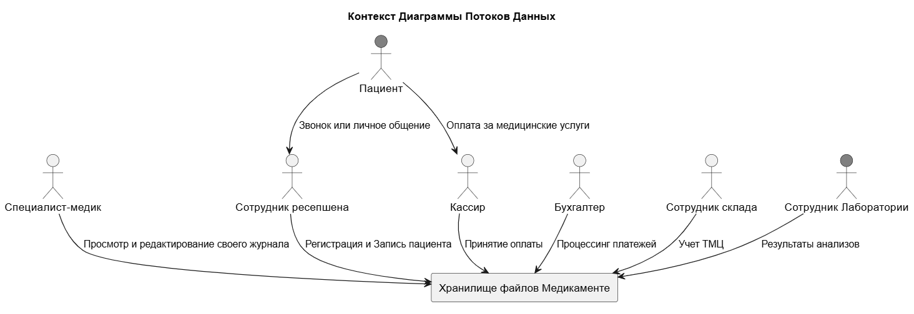
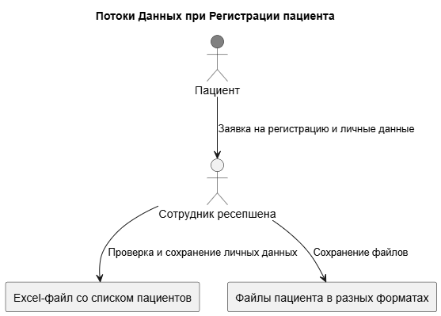
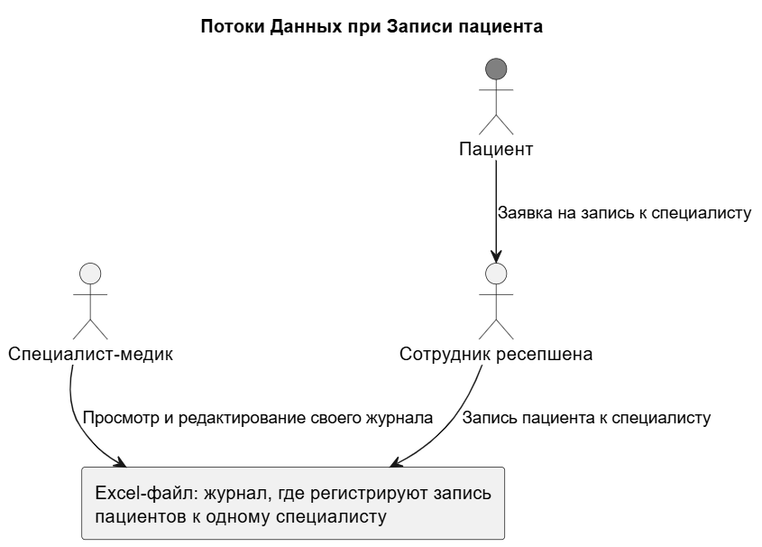
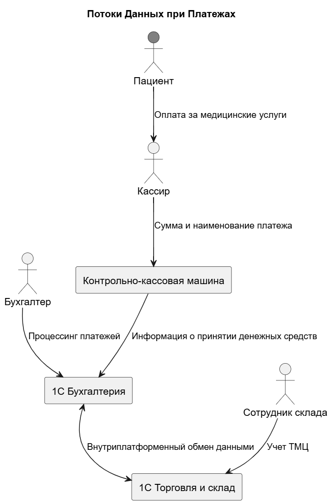
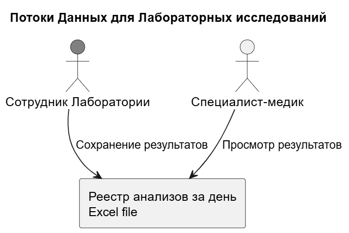
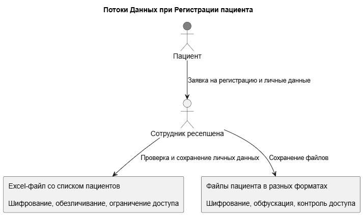
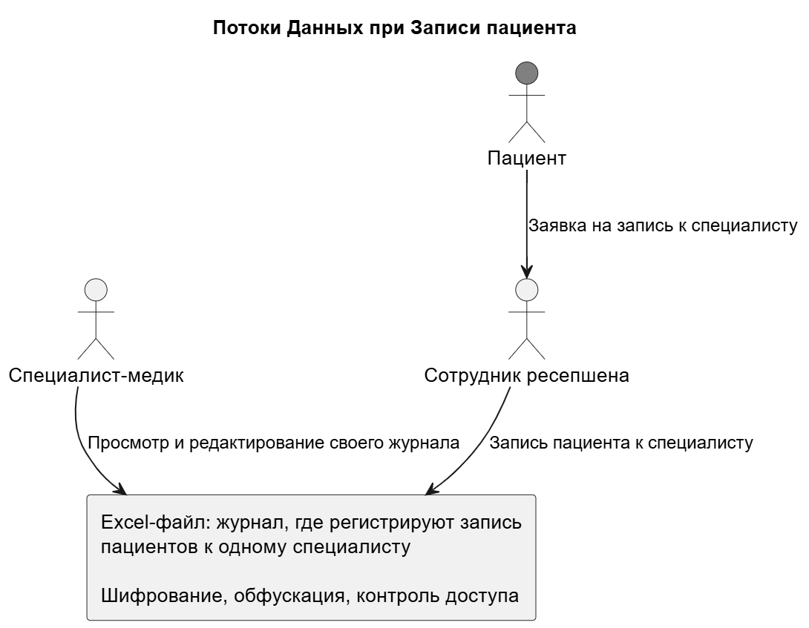
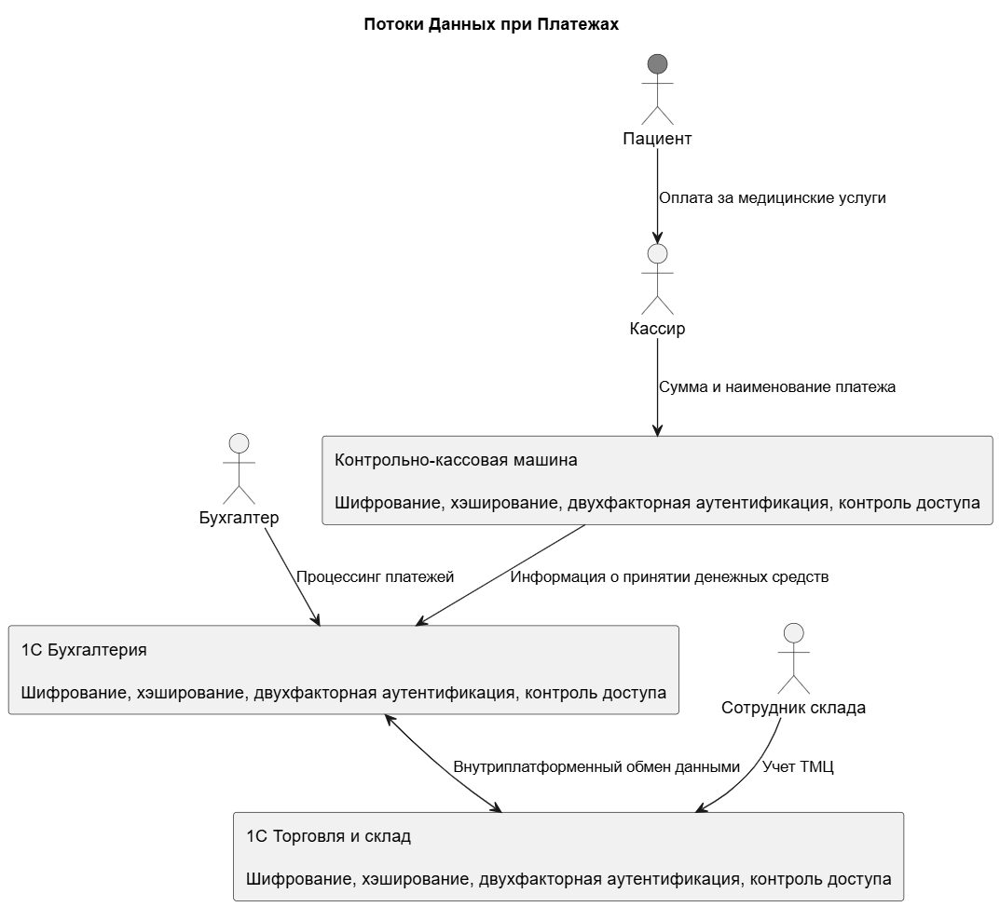
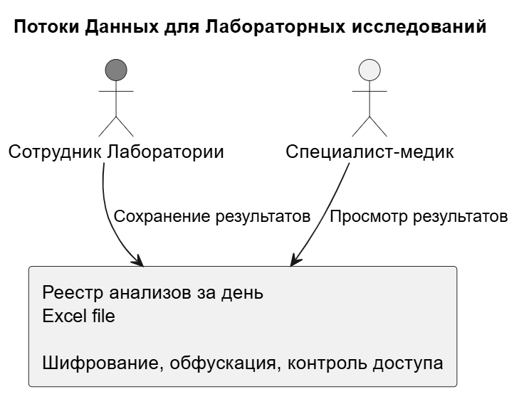

## Конфиденциальные данные

Список конфиденциальных данных, которые хранятся в системе:
 - Ф. И. О.
 - дату рождения
 - место
 - телефон
 - электронную почту
 - адресе прописки
 - месте работы или учёбы
 - хронические заболевания
 - результаты лабораторных исследований
 - платёжные документы

 ## Диаграммы потоков данных

 ### Контекст

### Потоки Данных при Регистрации пациента

### Потоки Данных при Записи пациента

### Потоки Данных при Платежах

### Потоки Данных для Лабораторных исследований

## Cписок проблемных зон
 - Каждый участник процесса имеет доступ к общим папкам, что делает всю содержащуюся в них информацию доступной для всех.
 - Сотрудники могут случайно или намеренно повредить данные, размещённые в этих папках.
 - Передача данных между системами осуществляется без использования шифрования и безопасных протоколов.
 - Отсутствует система учёта и контроля действий пользователей (аудит).
 - Не предусмотрено создание резервных копий данных.
 - Нарушается законодательство в области защиты персональных данных.

##  Что можно улучшить:

1. **Контроль доступа к данным**  
   - Внедрить модель минимальных привилегий (least privilege), чтобы не все сотрудники имели доступ ко всем данным.

2. **Защита целостности данных**  
   - Ограничить права на редактирование, добавить версионность файлов и контроль изменений.

3. **Шифрование при передаче данных между системами**  
   - Использовать защищённые протоколы: TLS, HTTPS, SFTP и др.

4. **Внедрение системы аудита**  
   - Логировать действия пользователей, особенно операции с чувствительными данными.

5. **Резервное копирование**  
   - Настроить регулярное бэкапирование с возможностью восстановления.

6. **Соблюдение закона о персональных данных**  
   - Провести инвентаризацию персональных данных, внедрить меры по их защите и обработке.

---

## Список данных для защиты и способы их защиты

| Тип данных | Примеры | Методы защиты |
|-----------|---------|----------------|
| Персональные данные  | ФИО, дата рождения, паспортные данные, телефон, email | Шифрование, обезличивание, ограничение доступа |
| Конфиденциальные данные | хронические заболевания, результаты лабораторных исследований, платёжные документы | Шифрование, обфускация, контроль доступа |
| Логины и пароли (после добавления) | Учётные записи сотрудников | Шифрование, хэширование, двухфакторная аутентификация |
| Идентификаторы пользователей | ID клиентов, номера аккаунтов | Обезличивание, тегирование, шифрование |
| Логи работы систем (после добавления) | Журналы действий, ошибки, входы | Обфускация, шифрование, аудит |

---

## Механизм тегирования данных

Тегирование помогает классифицировать данные и автоматически применять соответствующие меры безопасности.

### 1. **Создание классификации данных**
Устанавливаются категории данных:

- **Публичные** – доступны всем.
- **Внутренние** – только внутри компании.
- **Конфиденциальные** – ограниченный доступ.
- **Персональные** – требуют соблюдения законодательства.

### 2. **Инструменты тегирования**

Из соображений цены и универсальности интеграций OneTrust - отличный выбор.
Имеются готовые интеграции с продуктами Microsoft которые уже используются в компании https://www.onetrust.com/integrations/microsoft/

## Диаграммы потоков данных и способы их защиты

### Потоки Данных при Регистрации пациента

### Потоки Данных при Записи пациента

### Потоки Данных при Платежах

### Потоки Данных для Лабораторных исследований

