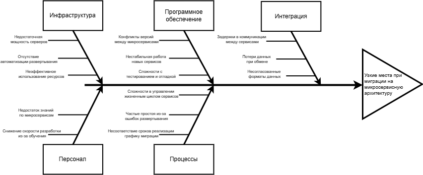

# Оценка узких мест при миграции

## Описание текущей системы и целей миграции
- Текущая система:
    - Устаревшая монолитная система с тесно связанными компонентами.
    - Централизованная база данных.
    - Все функциональные модули работают в рамках одного процесса.
    - Сложности масштабирования, обслуживания и обновления.
    - Высокая нагрузка на серверное оборудование.
- Цель миграции:
    - Перевести систему на микросервисную архитектуру для:
    - Гибкого масштабирования отдельных компонентов.
    - Повышения отказоустойчивости.
    - Быстрого внедрения изменений.
    - Повышения производительности и надежности.

## Ключевые процессы и компоненты, затрагиваемые миграцией

| Компонент | Описание | 
|-----------|---------|
| Базы данных | Разделение монолитной БД на сервисные хранилища. |
| Коммуникационные каналы | Внедрение API, шин данных, очередей сообщений. |
| Серверное оборудование | Масштабируемая инфраструктура, контейнеризация (Docker, Kubernetes).| 
| Бизнес-логика | Декомпозиция на независимые бизнес-сервисы |
| Мониторинг и логирование | Введение централизованного управления метриками и логами. |

## Диаграмма Исикавы для выявления потенциальных причин узких мест
 - Категория: Инфраструктура
    - Проблемы:
        - Недостаточная мощность серверов под микросервисы.
        - Отсутствие автоматизации развертывания.
        - Неэффективное использование ресурсов из-за множества контейнеров.
    - Причины:
        - Неправильно спроектированная инфраструктурная модель.
        - Отсутствие мониторинга нагрузки.
        - Несоответствие выбранной стратегии масштабирования реальной нагрузке.
 - Категория: Программное обеспечение
    - Проблемы:
        - Конфликты версий между микросервисами.
        - Нестабильная работа новых сервисов.
        - Сложности с тестированием и отладкой.
    - Причины:
        - Недостаточно зрелый CI/CD пайплайн.
        - Отсутствие четкой политики версионирования.
        - Использование несовместимых фреймворков или библиотек.
 - Категория: Интеграция
    - Проблемы:
        - Задержки в коммуникации между сервисами.
        - Потери данных при обмене.
        - Несогласованные форматы данных.
    - Причины:
        - Неправильно выбранный протокол взаимодействия (REST/gRPC).
        - Отсутствие брокера сообщений.
        - Недостаточная документация по API.
 -  Категория: Персонал
    - Проблемы:
        - Недостаток знаний по микросервисам.
        - Снижение скорости разработки из-за обучения.
    - Причины:
        - Отсутствие тренингов и коучинга.
        - Недостаточный опыт работы с новыми технологиями.
        - Непонимание принципов разделения ответственности.
 - Категория: Процессы
    - Проблемы:
        - Сложности в управлении жизненным циклом сервисов.
        - Частые простоя из-за ошибок развертывания.
        - Несоответствие сроков реализации графику миграции.
    - Причины:
        - Отсутствие четко определенного процесса деплоя.
        - Непродуманная стратегия тестирования.
        - Слабое планирование этапов миграции.

]

## Рекомендации по устранению узких мест

| Приоритет | Рекомендация | Обоснование |
|-----------|---------|----------------|
| Высокий | Аудит существующей инфраструктуры и выбор облачного провайдера | Обеспечивает гибкость и масштабируемость |
| Высокий | Внедрение CI/CD пайплайна с автоматическим тестированием | Снижает риск человеческой ошибки |
| Средний | Создание единой системы мониторинга (Prometheus, Grafana, ELK) | Позволяет оперативно выявлять проблемы |
| Средний | Подготовка команды через обучение и коучинг | Повышает качество и скорость разработки |
| Низкий | Внедрение шины данных (Apache Kafka, RabbitMQ) | Улучшает надежность межсервисного обмена |
| Низкий | Формализация процессов деплоя и тестирования | Повышает предсказуемость релизов |